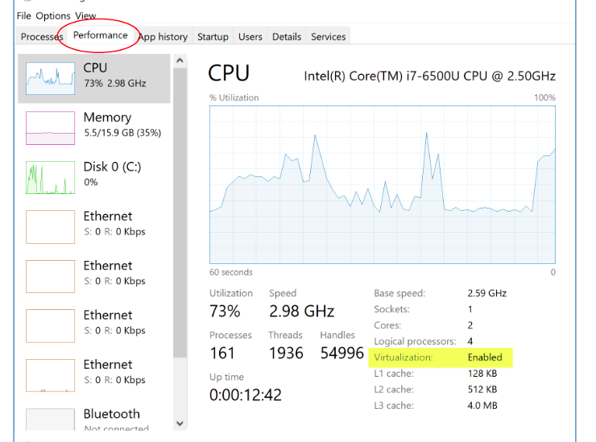

## IT-Academy-manager

Is an app for managing students and class schedules.

## Runing the app

$ npm run start

For database used Docker. Run Docker:

$ docker compose up

## Swagger 
This project uses the Nest swagger module for API documentation. NestJS Swagger - www.swagger.io
Swagger docs will be available at localhost:5000/docs

## Using Docker

For usung Dcoker you need instal it before.

Installation instructions can be found here: https://docs.docker.com/desktop/windows/install

If you use windows you must have vitrealization enabled. For this you need turn on it in BIOS like this:

You should see in the task manager that virtualization is enabled:

